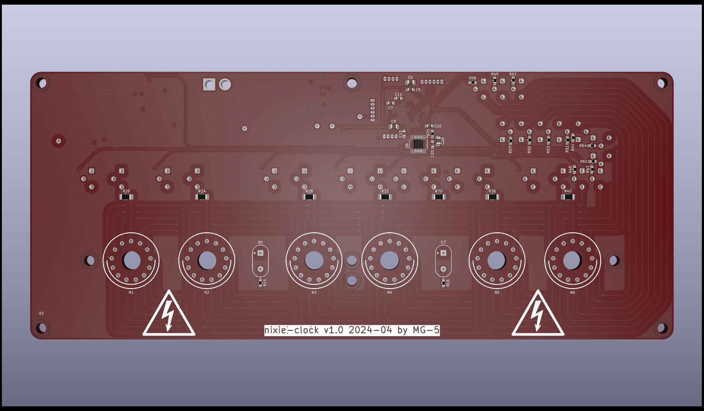
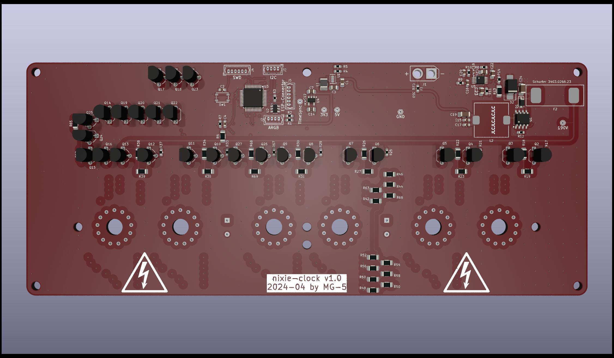

# nixie-clock-hardware
Hardware for controlling six Nixie IN-14 tubes as clock (HH:MM:SS) 

### Requirements for rev 1.0
* efficient step-boost converter up to 190V
* multiplexing
* control syncronous addressable LEDs
* PWM control
* I²C interface
* connector for ESP (UART)
* time syncronisation line for every second

### Known issues in rev 1.0
* octal buffer for PWM use seems do not works for dimming
  * workaround: dimming solved by adding turn-off points in mulitplexing routine (firmware-based solution)
* bad mosfet selection -> high R_DSOn lead to heat at high current due diode reverse current shots
  * workaround: use better Mosfet with TDSON-8 footprint that can be soldered onto the existing one
  * caution: soldering TDSON-8 with thermal pad on back causes short circuit due to untented via underneath pad
* output cap is to small -> causes high voltage ripple
  * workaround:
    * add 2.2uF with 2220 footprint
    * add 180uF electrolytic cap
* ESD protection on ARGB connector has wrong wiring
  * workaround: do not use USBLC6 and add enameled copper wires

### Pictures (rev 1.0)

